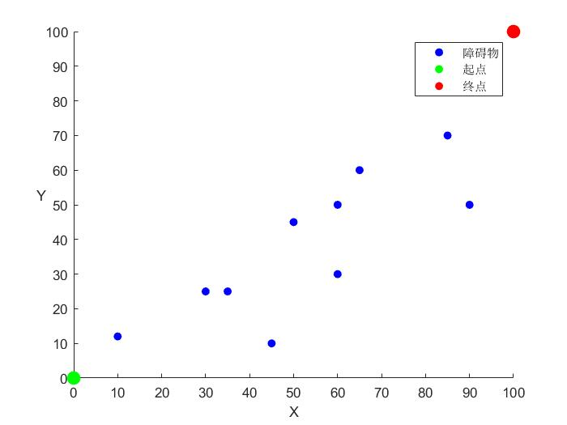
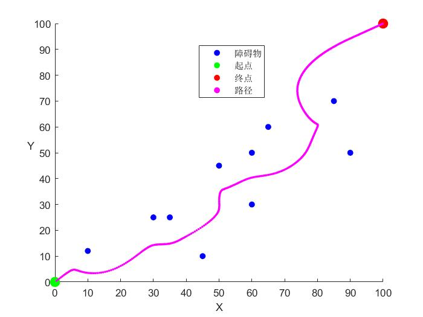

# Artificial-Potential-Field

​        本文将会从以下几个部分完成本次人工势场法的练习。

- 首先介绍人工势场法的一些基本理论公式
- 使用Matlab软件绘制散点图，创建一个模拟地图，定义起始点、终点和障碍物，利用人工势场法求出机器人由起始点到终点的路径
- 针对人工势场法的不足，尝试使用改进的人工势场法解决问题

## 一、首先说明

- 如果您是Github用户，请使用谷歌浏览器打开本网站，并且确保已经安装MathJax(MathJax Plugin for Github)插件，否则本README中的公式将无法正常显示，当然，您也可以克隆整个工程到您的本地仓库，工程文件中有PDF格式的README（由Typora直接导出），可以正常显示公式，但图片略有错位
- 工程的代码在code文件夹中，img文件夹是README中所用到的图片
- 本次练习其实是作为《机器人导航》一课中的某次作业，时间有限，做得也不算太完整，希望大家见谅
- 本次人工势场法练习均是在二维空间进行


## 二、预备知识

​        人工势场法(Artificial Potential Field)，是路径规划中一种比较常用的算法。这种方法将机器人置身于一个势场当中，机器人在不同的位置所受到的“趋势”不一样，最终在“趋势”的作用下避开障碍物到达目的地。

<center class="half">
    
    
</center>


​		如上图所示，目的地位于“地势”较低的点，障碍物位于“地势”较高的点，而机器人则可以想象成一个小球，从地势较高的点一直滚动到地势较低的点。那么问题来了，机器人怎么知道自己该往哪个方向“滚”呢？如何对这种趋势进行定义呢？

​		这里就不得不引入“梯度下降法”，梯度下降法是一种最优化方法，在神经网络中有极其重要的应用。这里举一个梯度下降法的形象例子：有一个人正在下山，但是他并不知道应该往哪个方向走，他便环顾四周，观察身边地形的坡度，最终他选择朝着最陡的方向迈出一步，到达新的位置，再次重复上述过程。

​		更准确地说，上述例子的坡度，可以理解为斜率，而斜率在数学中可以理解为一阶导数，而各个方向的一阶导数（偏导数），则可以表示为梯度，这也是梯度下降法“梯度”一词的由来。

​		在人工势场法当中，机器人所处的势场分为引力势场和斥力势场（两者的合场），引力势场由目的地定义，斥力势场由障碍物定义，公式如下：

### 引力场

$$
U_{a t t}(q)=\frac{1}{2} \xi\rho\left(q,q_{g o a l}\right)^{2} \\
其中，\xi\ 是尺度因子， \rho\left(q,q_{g o a l}\right)表示机器人当前位置与目标位置之差
$$

引力场定义好了，那么引力则是引力场对距离的导数（更准确应该是求梯度，只不过变量只有一个，也就是求导数）：
$$
F_{a t t}(q)=-\nabla U_{a t t}(q)=\xi\left(q_{\text {goal }}-q\right)
$$
将引力分解为x，y两个方向
$$
F_{attx}(q)=-K_{att}(x-x_{goal})\\
F_{atty}(q)=-K_{att}(y-y_{goal})\\
K_{att}为引力尺度因子，与上式\xi一样
$$


### 斥力场

$$
U_{\text {rep }}(q)=\left\{\begin{aligned}
\frac{1}{2} \eta(\frac{1}{\rho\left(q, q_{o b s})}-\frac{1}{\rho_{0}}\right)^{2}, & \text { if } \rho(q, q_{o b s}) \leq \rho_{0} \\
0, & \text { if } \rho(q, q_{o b s})>\rho_{0}
\end{aligned}\right.
\\
其中，\eta是斥力尺度因子，\rho(q, q_{o b s})表示机器人和障碍物之间的距离，\rho_{0}表示障碍物的影响半径
$$

同样的，斥力就是斥力场的梯度
$$
F_{r e p}(q)=-\nabla U_{r e p}(q)= \begin{cases}0, & \text { if } \rho\left(q, q_{o b s}\right) \geq \rho_{0} \\ K_{r e p}\left(\frac{1}{\rho\left(q, q_{o b s}\right)}-\frac{1}{\rho_{0}}\right)\left(\frac{1}{\rho\left(q, q_{o b s}\right)^{2}}\right) \frac{q-q_{o b s}}{\| q-q_{obs}\|}, & \text { if } \rho\left(q, q_{o b s}\right)<\rho_{0}\end{cases}\\
其中，K_{rep}是斥力尺度因子，与上式的\eta一样
$$
将斥力分解为x，y方向
$$
F_{r e px}(q)= \begin{cases}0, & \text { if } \rho\left(q, q_{o b s}\right) \geq \rho_{0} \\ K_{r e p}\left(\frac{1}{\rho\left(q, q_{o b s}\right)}-\frac{1}{\rho_{0}}\right)\left(\frac{1}{\rho\left(q, q_{o b s}\right)^{2}}\right) \frac{x-x_{o b s}}{\| q-q_{obs}\|}, & \text { if } \rho\left(q, q_{o b s}\right)<\rho_{0}\end{cases}
\\
F_{r e py}(q)= \begin{cases}0, & \text { if } \rho\left(q, q_{o b s}\right) \geq \rho_{0} \\ K_{r e p}\left(\frac{1}{\rho\left(q, q_{o b s}\right)}-\frac{1}{\rho_{0}}\right)\left(\frac{1}{\rho\left(q, q_{o b s}\right)^{2}}\right) \frac{y-y_{o b s}}{\| q-q_{obs}\|}, & \text { if } \rho\left(q, q_{o b s}\right)<\rho_{0}\end{cases}
$$

### 总场

总的场就是斥力场和合力场的累加
$$
U_{合}=U_{att}+U_{rep}
$$
总的力也是斥力和合力的累加（分x，y方向即可）
$$
F_{x合}=F_{attx}+F_{repx}\\
F_{y合}=F_{atty}+F_{repy}
$$
最后乘以步长到达新的位置就可以迭代了~

## 三、开始实验

​		本实验将构造一张100*100的地图，求出起点(0,0)，到终点(100,100)的路径。

### 实验过程

​		先定义各个元素的位置，包括起始点、终点、障碍物的位置坐标，本次练习设置10个障碍物。初始坐标定义如下：

```matlab
%% 起始点位置

MyX = 0;                                    % 出发点位置
MyY = 0;
DesX = 100;                                 % 终点位置
DesY = 100;

a1 = [10,12];                               % 障碍物
a2 = [30,25];
a3 = [35,25];
a4 = [50,45];
a5 = [60,50];
a6 = [85,70];
a7 = [60,30];
a8 = [90,50];
a9 = [65,60];
a10 = [45,10];

Obs = [a1;a2;a3;a4;a5;a6;a7;a8;a9;a10];     % 障碍物坐标矩阵
```

​		再对公式里的超参数进行定义和赋值（参数整定后面再讲）：

```matlab
%% 超参数设置
Kaat = 0.1;                     % 引力尺度因子
Krep = 10000;                   % 斥力尺度因子
P0 = 25;                        % 斥力作用范围
StepRate = 0.05;                % 步长
Epoch = 2000;                   % 最大迭代次数			
```

​		而后画出初始的坐标地图

```matlab
%% 画图
hold on
a = scatter(Obs(1:10,1)',Obs(1:10,2)','b','filled');
b = scatter(MyX,MyY,100,'g','filled');
c = scatter(DesX,DesY,100,'r','filled');
xlabel("X");
y = ylabel("Y");
set(y,'Rotation',0);
xlim([0,100]);
ylim([0,100]);
legend([a,b,c],{'障碍物','起点','终点'});
```

​		运行效果如下：

<center>
    
</center>

​		下面开始编写计算函数：

​		根据公式，我们至少要实现两个函数，一个是计算目的地引力的公式，一个是计算障碍物排斥力的公式。在Matlab中，创建两个文件各自实现这两个函数。

​		在Attractive.m文件中，根据引力公式（引力场的一阶导数），编写相应的代码，计算出X，Y坐标上的引力分量

```matlab
function [Fattx,Fatty] = Attractive(x0,x1,y0,y1,k)
    Fattx = -k*(x0-x1);
    Fatty = -k*(y0-y1);
end
```

​		在Repulsive.m文件中，根据斥力公式（斥力场的一阶偏导数），计算某个障碍物对机器人的斥力

```matlab
function [Frepx,Frepy] = Repulsive(x,y,ox,oy,k,P0)
% 先计算与障碍物的欧氏距离
Pobs = sqrt((x-ox)^2 + (y-oy)^2);
    if(Pobs>P0)
        Frepx = 0;
        Frepy = 0;
    else
        Frepx = k * (1/Pobs - 1/P0) * (1/Pobs^2) * ((x-ox)/Pobs);
        Frepy = k * (1/Pobs - 1/P0) * (1/Pobs^2) * ((y-oy)/Pobs);
    end
end
```

​		最后在主函数中进行迭代，再加一些超时判断、画图的语句即可

```matlab
%% 计算
CountFlag = 0;
while(1)
    
   [Fattx,Fatty] = Attractive(MyX,DesX,MyY,DesY,Kaat);                                % 引力计算
  
   Frepx = zeros(1,10);
   Frepy = zeros(1,10);
   for i = 1:10
       [Frepx(1,i),Frepy(1,i)] = Repulsive(MyX,MyY,Obs(i,1),Obs(i,2),Krep,P0);        % 斥力计算
   end
   
   Fxsum = Fattx + sum(Frepx);
   Fysum = Fatty + sum(Frepy);
   
   PositionAngle = atan(Fysum/Fxsum);

   MyX = MyX + StepRate*cos(PositionAngle);
   MyY = MyY + StepRate*sin(PositionAngle);
   
   d = scatter(MyX,MyY,5,'m','filled');
   
   if(abs(MyX-100) < 0.1 && abs(MyY-100)< 0.1 )
       fprintf("完成");
       break;
   end
   
   CountFlag = CountFlag + 1;
   if(CountFlag >= Epoch)
       fprintf("超时");
       break;
   end    
end

hold off
legend([a,b,c,d],{'障碍物','起点','终点','路径'});
display(CountFlag);
```

​		运行结果如下图所示：

<center>
    
</center>				

### 关于调参

经典的人工势场法的超参数有如下几个：

- 引力尺度因子
- 斥力尺度因子
- 斥力作用范围
- 步长
- 最大迭代次数

​		参数之间的数值大小非常悬殊，并且数值会随着地图尺寸的改变有非常大的变化，先上图：

<center>
    
    &emsp;
    
    &emsp;
    
    <br/>
    <font color="AAAAAA">图一</font>
    &emsp;&emsp;&emsp;&emsp;&emsp;&emsp;&emsp;&emsp;
    &emsp;&emsp;&emsp;&emsp;&emsp;&emsp;&emsp;&emsp;&emsp;
	<font color="AAAAAA">图二</font>
    &emsp;&emsp;&emsp;&emsp;&emsp;&emsp;&emsp;&emsp;
    &emsp;&emsp;&emsp;&emsp;&emsp;&emsp;&emsp;&emsp;&emsp;
    <font color="AAAAAA">图三</font>
    <br/>
</center>


​		图一是作业要求布置之前，使用10×10的坐标画出的图像，障碍物只有6个，最终算法收敛，超参数为

```matlab
Kaat = 5;                   % 引力尺度因子
Krep = 8;                   % 斥力尺度因子
P0 = 2.5;                   % 斥力作用范围
StepRate = 0.005;           % 步长
Epoch = 2000;               % 最大迭代次数
```

​		图二是将地图改为100×100的尺寸后，将相应的量（包括障碍物位置、超参数）均乘以10后所得的结果，很明显，规划出的路径并不能很好地规避障碍物，但从图中可以看出，机器人对障碍物不敏感，原因可能是引力尺度因子太大，或斥力尺度因子太小，基于这个方向，再次进行参数整定，最终实现图三效果的参数如下：

```matlab
Kaat = 0.1;                 % 引力尺度因子
Krep = 10000;               % 斥力尺度因子
P0 = 25;                   	% 斥力作用范围
StepRate = 0.05;           	% 步长
Epoch = 2000;               % 最大迭代次数
```

​		总结：起决定性作用的超参数有引力尺度因子、斥力尺度因子和斥力作用范围，而斥力作用范围参数大致适中即可，较难整定的是引力尺度和斥力尺度，两者的大小、数量级并无大致的范围，需要落实到具体问题中进行调试。

### 更多的尝试

​		一遍的实验显然是不够的，我们可以使用Matlab中的随机数生成函数来生成均匀分布的伪随机数矩阵，语法如下：

```matlab
Obs = randi([0,100],10,2);
```

​		其中，Obs与上文一样是障碍物矩阵，再通过循环和子图的代码，可以同时输出多次结果：

<center>
    
    <br/>
    <font color="AAAAAA">图&emsp;&emsp;经典人工势场法的多次尝试结果</font>
</center>	

​		从上图不难看出，在多次的实验中，经典人工势场法并不能每次在最大迭代次数中找到路径，相反，在某些情况下，由于梯度下降法的缺陷，机器人往往陷入“局部最优”之中无法自拔，“局部最优”从场的角度理解，可以认为机器人在下山的过程中掉进了一个坑里，无法从坑中脱离。从力的角度理解，可以认为机器人所受的排斥力和吸引力在矢量上抵消了，导致机器人无法再继续行进。

### 一些不足

​		除了上述提到的“局部最优”，经典的人工势场法还存在一些问题。

1. 当地图很大时，机器人离目标点比较远，根据引力公式，易知引力的大小与距离（机器人与目标点的距离）成正比。这时引力会变得非常大，而斥力则显得相对较小，机器人在行进中容易与障碍物发生碰撞。
2. 当机器人遇到多个靠近的障碍物时，容易陷入“局部最优”。
3. 当目标点附近有障碍物时，引力会变得非常小（引力与距离成正比），但斥力会变得非常大（斥力与距离成反比），这时机器人难以达到目标点。

## 四、改进的人工势场法

### 改进一

对于第一个问题，引力过大可以通过修改引力函数进行优化，使得机器人离目标点较远时，受到的引力应有所减少，减少的幅度也应与距离有关。一般的改进公式如下：

引力场：
$$
U_{att}(q)= \begin{cases}\frac{1}{2} K_{a t t}\left(q-q_{g}\right)^{2}, & \text { if }\left(q-q_{g}\right) \leq d \\ d K_{a t t}\left(q-q_{g}\right)-\frac{1}{2}K_{att}d^{2}, & \text { if }\left(q-q_{g}\right)>d\end{cases}
\\其中，K_{att}为引力尺度因子，q为机器人的位置，q_{g}为目标点的位置，d为某一特定距离，在本文中成为距离因子
$$
对应的引力为：（对距离求一阶导数）
$$
F_{att}(q)=-\nabla U_{att}(q)= \begin{cases}K_{att}(q_{g}-q), & \text { if } \left(q-q_{g}\right) \leq d \\ -dK_{att}\frac{q-q_{g}}{\|q-q_{g}\|}, & \text { if } \left(q-q_{g}\right)>d\end{cases}\\
$$
创建一个新的文件AttractiveImprove.m，根据上述公式写出代码：

```matlab
function [Fattx,Fatty] = AttractiveImprove(x0,x1,y0,y1,k,d)
    Distence = sqrt((x0-x1)^2 + (y0-y1)^2);
    if(Distence <= d)
        Fattx = -k*(x0-x1);
        Fatty = -k*(y0-y1);
    else
        Fattx = -d*k*((x0-x1) / Distence);
        Fatty = -d*k*((y0-y1) / Distence);
    end
end
```

### 改进二

针对第三个问题，可以对斥力场公式作如下修改：
$$
U_{\text {rep }}(q)=\left\{\begin{aligned}
\frac{1}{2} \eta\left(\frac{1}{\rho\left(q, q_{o b s}\right)}-\frac{1}{\rho_{0}}\right)^{2}\rho^{n}(q,q_{goal}), & \text { if } \rho\left(q, q_{o b s}\right) \leq \rho_{0} \\ 0, & \text { if } \rho\left(q, q_{o b s}\right)>\rho_{0}
\end{aligned}\right.
\\其中n为正数，参考资料中n=2,q_{goal}为目标点位置，q_{obs}为障碍物的位置
$$
对比可知，改进的斥力场公式在原来的基础上乘上了一个数，这个数是机器人与目标点距离的n次幂，直观上说，物体靠近目标时虽然斥力场还是在增大，但是增大的速率较原来而言减慢了，在一定程度上可以缓解斥力过大的问题。

对应的斥力公式为：
$$
F_{r e p}(q)=-\nabla U_{r e p}(q)= \begin{cases}a_{1}\eta\left(\frac{1}{\rho\left(q, q_{o b s}\right)}-\frac{1}{\rho_{0}}\right)\frac{\rho^{n}(q,q_{goal})}{\rho^{2}(q,q_{obs})}+a_{2}\frac{n}{2}\eta\left(\frac{1}{\rho\left(q, q_{o b s}\right)}-\frac{1}{\rho_{0}}\right)^2\rho^{n-1}(q,q_{goal}), & \text { if } \rho\left(q, q_{o b s}\right) \leq \rho_{0} \\ 0, & \text { if } \rho\left(q, q_{o b s}\right)>\rho_{0}\end{cases}\\
$$
其中
$$
a_{1}=\nabla\rho(q,q_{obs})=\frac{q-q_{obs}}{\|q-q_{obs}\|}\\
a_{2}=-\nabla\rho(q,q_{goal})=-\frac{q-q_{goal}}{\|q-q_{goal}\|}
$$
 同样地，创建一个新的文件RepulsiveImprove.m，根据上述公式写出代码（取n=2）：   

```matlab
function [Frepx,Frepy] = RepulsiveImprove(x,y,ox,oy,x0,y0,k,P0)
Pobs = sqrt((x-ox)^2 + (y-oy)^2);           % 障碍物离机器人距离
Pdes = sqrt((x-x0)^2 + (y-y0)^2);           % 目标点离机器人距离
    if(Pobs>P0)
        Frepx = 0;
        Frepy = 0;
    else
        Frepx = (k * (1/Pobs - 1/P0) * (Pdes^2)/(Pobs^2) * ((x-ox)/Pobs)) + (2/2 * k * (1/Pobs - 1/P0)^2 * Pdes * ((x0-x)/Pdes));
        Frepy = (k * (1/Pobs - 1/P0) * (Pdes^2)/(Pobs^2) * ((y-oy)/Pobs)) + (2/2 * k * (1/Pobs - 1/P0)^2 * Pdes * ((y0-y)/Pdes));  
    end
end
```

### 改进尝试

将这两个改进的方法同时进行尝试，需要对超参数进行修改才可输出可观的效果，超参数修改如下：	

```matlab
% 改进方法下的超参数设置
Kaat = 0.5;                     % 引力尺度因子
Krep = 0.5;                   	% 斥力尺度因子
P0 = 25;                        % 斥力作用范围
StepRate = 0.5;                	% 步长
Epoch = 2000;                   % 最大迭代次数
de = 20;                        % 引力距离因子
```

最终输出的结果如下图：

<center>
    
    <br/>
    <font color="AAAAAA">图&emsp;&emsp;改进人工势场法的多次尝试结果</font>
</center>		

应当关注的是第二列第三幅图和第三列的第三幅图，目标点附近有一障碍物，但改进的人工势场法仍能避开障碍物到达目标点，一定程度可以说明改进方法的优越性。

### 改进对比

下面使用同一组障碍物比较改进前后的实际效果

<center>
    
    &emsp;&emsp;&emsp;&emsp;&emsp;&emsp;&emsp;&emsp;&emsp;&emsp;
    
    <br/>
    <font color="AAAAAA">图一 经典人工势场法</font>
    &emsp;&emsp;&emsp;&emsp;&emsp;&emsp;&emsp;&emsp;&emsp;&emsp;
    &emsp;&emsp;&emsp;&emsp;&emsp;&emsp;&emsp;&emsp;&emsp;&emsp;
	<font color="AAAAAA">图二 改进人工势场法</font>
    <br/>
</center>

图一图二的障碍物位置完全一样，图一使用的是经典的人工势场法，图二使用的是改进的人工势场法

从图中可以观察得到，目标点附近有一障碍物：

先分析图一，在目标点附近，由于有障碍物的作用，经典的势场法受到的斥力很大，引力很小，于是需要绕比较远的距离抵达目标

再分析图二，采用改进的方法后，在接近目标点时，虽然仍受到障碍物的影响，但是障碍物的排斥力远没有图一这么大了，只需要短距离的绕行即可到达目标

需要指出的是：两种方法的超参数并不相同（只有引力斥力因子不同，其余都一样），也就是说引力斥力因子不同，机器人在两种情况下受到的引力和斥力是不同的，但是从图中的其他障碍物的斥力可以看出，图一在远未达到目标点时，障碍物的斥力作用远小于快抵达目标点时的斥力作用；而在图二中，机器人远未到达目标点时，障碍物的斥力作用远大于快抵达目标点时的斥力作用。

换言之，图一中机器人受到的斥力要远小于图二中机器人受到的斥力，也就是说，改进的方法在受到更大的斥力时，在临近抵达目标点的表现，比经典的方法还要好，这更体现出了改进人工势场法相比于经典人工势场法的优越性！

## 五、结语

​		本次练习先从理论切入，分析了人工势场法的原理和数学表达，通过Matlab工具，进行一定程度的仿真实验。根据实验现象，提出了几个经典人工势场法所面临的问题，而后针对这些问题，通过查询资料，复现了其中一种人工势场法的改进方法，并在最后对两者进行横向比较，得出相应的结论。而需要补充的是，“局部最优”问题是人工势场法的一大难题，甚至其在深度学习中也颇为棘手，通常的解决方案是在机器人每次移动是增加一个随机量，使得机器人可以跳出“局部最优”，但由于篇幅原因不再往下深究，希望日后仍能有机会继续研究吧！

## 参考资料：

- 《路径规划-人工势场法》-- https://blog.csdn.net/junshen1314/article/details/50472410
- 《机器人导航》（课件）--李辉
- 《解决人工势场法局部极小问题的一种新方法》 --刘佳，李春书
- 《[Artificial Potential Field Approach and its Problems](https://www.robotshop.com/community/forum/t/artificial-potential-field-approach-and-its-problems/11821)》--https://www.robotshop.com/community/forum/t/artificial-potential-field-approach-and-its-problems/11821


